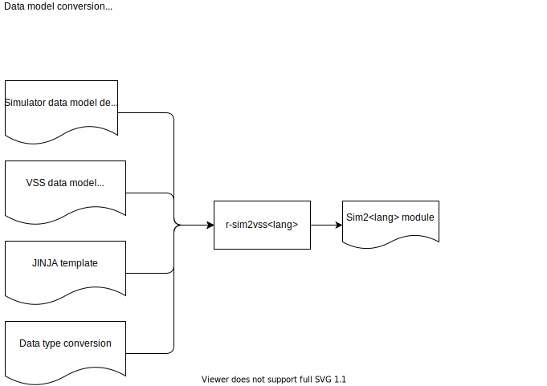

# Renesas Simulator Format Converters and Code Generation

Tooling to convert formats and generate code to simplify connecting the Renesas Connected Car Simulator to the VSS eco-system.

## Overview
### Format Conversion
The Renesas Simulator uses a data model that is very similar to VSS. For example, it uses a tree structure data definition and like VISS uses JSON to serialise the data. The aim is to use the vss-tools eco-system to automate the data model conversion.

### Code Generation
The aim is to develop code generators that convert between the Simulator and VSS data models. The output can then flexibly be used in a variety of runtime components such as an VSS Data Feeder.

## Format Conversion
To enable maximum use of the vss-tools eco-system and its functions the Simulator data model has itself been specified in VSS vspec format.

## Code Generation
 The intention is to use the design pattern developed in the Covesa Android Vehicle HAL project to convert between VSS and Android VHAL Properties. By reusing the design pattern across the VSS eco-system the hope within the CVII Tech Stack project is to increase adoption and collaboration and reduce multiple implementations where not necessary.

 The pattern uses JINJA templating and files explaining the data model mapping to output a module that provides APIs to provide a runtime conversion.

