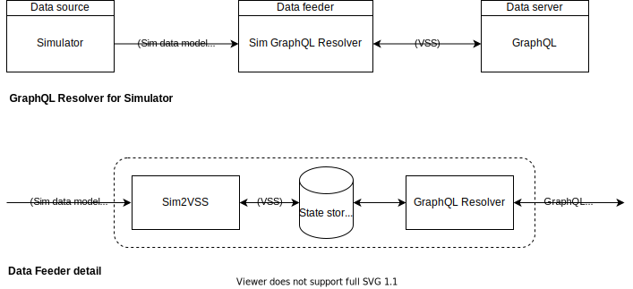

# Renesas Simulator VSS Data Feeders

Components to allow the Renesas Simulator to act as a VSS Data Feeders to VSS Data Servers such as VISS or GraphQL.

## VISS approaches

### VISS Relay using VISS 'Set' method
The VISS specification has an [Update method](https://w3c.github.io/automotive/spec/VISSv2_Core.html#update) to set VSS data. A data feeder could be implemented using a websocket server that converts between the data models and writes the data to the VISS server using the VISS Update Method.

Advantages/disadvantages:

+ve: Works with any VISS implementation

-ve: Scales less well to high volume data

### Direct Feed using VISS Backend
A feeder can be implemented as a backend in the VISS server itself. This has already been successfully implemented in platforms such as [Aos](https://aoscloud.io/). As with the relay above conversion between the data models is required. The VSS data is then transported to the appropriate place in the server, most likely written to its data store.

The backend may be an internal plug-in in the server architecture or an external component that writes to the state storage (data store) APIs of the server. In either case the main collaboration point is the need for an open API interfacing the backend to the server.

Advantages/disadvantages:

+ve: Can more easily scale with data volume

-ve: Currently no open standard for VISS data feeder backend API exists, which leads to unwanted extra development effort to interface any conversion component into each VISS implementation.

### Investigation points
- [ ] VISS spec states Update method only allows actuator values to be set, but this would stop sensor values from being reported by the Simulator. Need to check what VISS implementations do in practice and raise discussion in VISS community.
- [ ] CVII needs to consider possible open standard for VISS backend API.

## GraphQL approaches
In GraphQL a Resolver performs the fetch needed to complete the query. Two major tasks of a GraphQL data feeder would therefore be data model conversion and the Resolver to supply the queried data to the GraphQL Data Server.

For simple 'fetch' queries the feeder could use a simple state storage internally which holds the last data sent by the simulator. An alternative is to query the simulator directly.

When state storage is replaced by a more functional in-vehicle data store such as a database then richer queries are possible, at the possible complication of more complicated connection between the Resolver and the GraphQL Schema.

Covesa has a collection of GraphQL components, e.g. [GraphQL Data Server](https://github.com/COVESA/graphql-vss-data-server) that would be an obvious implementation starting point.

### Investigation points
- [ ] Investigate use of simple state storage to store 'last value' from the Simulator for Resolver access vs querying the Simulator directly.
- [ ] Is the Resolver API a sufficient data fetch abstraction API or is something nearer to the data store required? For example changing between DB, 'simple' State Storage or 'read sensor/actuator' API.

## In-vehicle data store approaches
Of course as well as the methods outlined above the Simulator could be interfaced by writing VSS data to an in-vehicle data store such as a Timeseries database. In that approach the Simulator does not need to be interfaced to a specific data server. The connection between the data store and the server takes care of that. This makes it an area of investigation in its own right and is being investigated in the "in-vehicle-storage" area of this project. See the [README.md](../in-vehicle-storage/README.md)