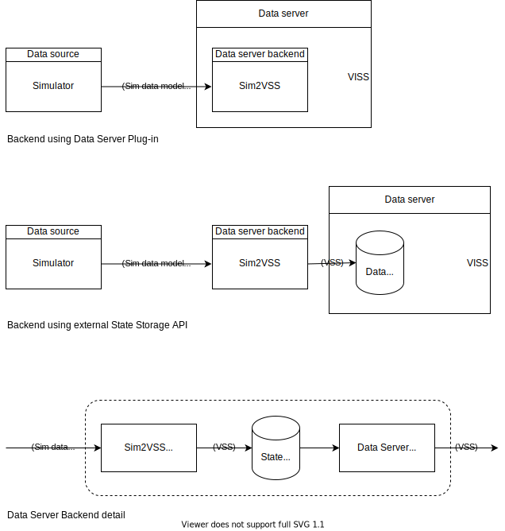

# Renesas Simulator VSS Data Feeders

Components to allow the Renesas Simulator to act as a VSS Data Feeders to VSS Data Servers such as VISS or GraphQL.

## VISS approaches

### VISS Relay using VISS 'Set' method
The VISS specification has an [Update method](https://w3c.github.io/automotive/spec/VISSv2_Core.html#update) to set VSS data. A data feeder could be implemented using a websocket server that converts between the data models and writes the data to the VISS server using the VISS Update Method.

Advantages/disadvantages:

+ve: Works with any VISS implementation
-ve: Does not scale to high volume data

### Direct Feed using VISS Backend
A feeder can be implemented as a backend in the VISS server itself. This has already been successfully implemented in platforms such as [Aos](https://aoscloud.io/) 

Advantages/disadvantages:

+ve: Can more easily scale with data volume
-ve: Currently no open standard for VISS data feeder backend API exists, which leads to unwanted extra development effort to interface any conversion component into each VISS implementation.

### Investigation points
- [ ] VISS spec states Update method only allows actuator values to be set (makes sense), but this would stop sensor values from being reported by the Simulator. Need to check what VISS implementations do in practice.
- [ ] CVII needs to consider possible open standard for VISS backend API

## GraphQL approaches
<fixme expand> Sim=>VSS=>GraphQL Resolver=>Alex GraphQL

## In-vehicle data store approaches
Of course as well as the methods outlined above the Simulator could be interfaced by writing VSS data to an in-vehicle data store such as a Timeseries database. In that approach the Simulator does not need to be interfaced to a specific data server. The connection between the data store and the server takes care of that. This makes it as an area of investigation in its own right and is being investigated in the "in-vehicle-storage" area of this project. See the [README.md](../in-vehicle-storage/README.md)