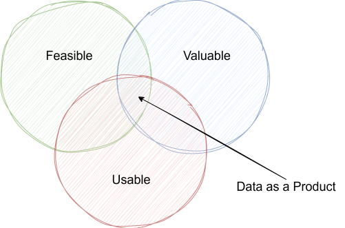
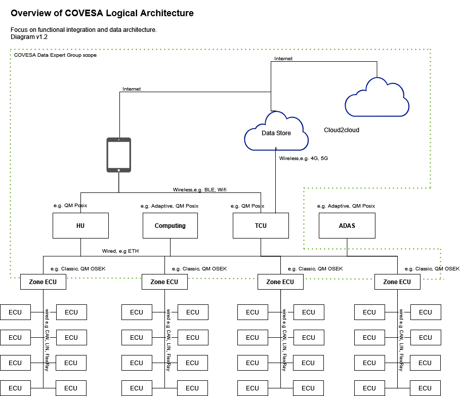
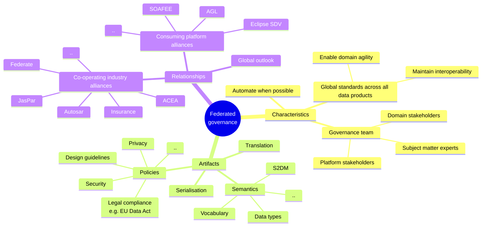

Applying the four principals of Data Mesh as a dev framework for COVESA data modelling
===

*This article discusses using the four principals of Data Mesh as a framework to inform the development of COVESA data modelling. Such as VSS, S2DM, VDM and associated models.*

Author: Stephen Lawrence, Renesas Electronics.

# Where we are
<!-- section outline:
+ Scene setting
    + VSS is very successful.
    + Recognition that improvements possible.
    + Scaling and growth (S2DM/VDM)
+ Wide audience
+ Solution scene setting
    + Technology agnostic
    + Recognise social aspects for success
    + Enhancing membership value
        + Relationship between COVESA and its consumers.
        + If COVESA took more of a product approach they could enhance membership value
    + S2DM/VDM charter
-->

The COVESA Vehicle Signal Specification (hereafter called VSS) is a widely adopted open data model that provides an abstract (normalized) view of the vehicle [^vss].

From my decade long technical involvement in first GENIVI and then the COVESA automotive alliances I have watched characteristics such as its simplicity and flexibility lead to it being widely adopted.

I have also seen the technical and social challenges reported by adopters. Questions such as: How to combine it with APIs? How to use the actuator model? Questions about the governance and scope of the reference catalog.

At the same time VSS has not evolved in a vacuum. The industry is tackling delivery of the Software Defined Vehicle. OEMs are seeking greater development agility through new architectures, looser component coupling and new abstractions and viewpoints that seek to use consistent data models and methods across in-vehicle, mobile devices and the cloud. Whilst new demands have moved the data model somewhat from its beginnings as a signal model towards a purer data model containing a range of data.

Another emerging need is the need to flexibly combine the VSS data model with data from domains outside of the vehicle. Such as personal, service and environment data. Directly adding this data to the VSS data model would create a tightly coupled model that would be hard to scale and maintain. Instead, a flexible way to reference such models is needed to meet the needs of adjacent industries and service providers.

## Seeking future value and solutions
COVESA projects in recent years have been investigating scaling the data model to meet these needs and others.

For example, most recently the Vehicle Data Model project has been investigating evolving the data modelling itself with positive results [^vdm]. Whilst the Capabilities project has worked on standardising the properties of the vehicle seat abstracted from underlying hardware to reduce integration complexity and promote re-use [^capabilities-proj]. There are also ongoing projects focused on integrating the data modelling with adjacent industries such as commercial vehicles and insurance.

[^capabilities-proj]: https://covesa.atlassian.net/wiki/x/FR5UAg

Of course, experience tells us that successful technology transformations require more than just a technical solution. Social aspects such as communicating business benefit and design patterns as also required.

Individual COVESA members consume COVESA artifacts such as VSS to create their products. Often making different technological choices in implementation. The details of which may be differentiating and therefore naturally remain proprietary to the product, i.e. secret. From the perspective of *wearing a company hat* it is also natural that delivery of those *company products* is a priority.

Having acknowledged that reality, in this article I wish to turn to the perspective of *wearing a COVESA hat* and concentrate on evolving the delivery of *COVESA artifacts*. With the goal of strengthening the COVESA offerings, by delivering more rounded artifacts, to support the creation of data products at greater scale and cross product needs such as data interoperability. In doing so strengthening the relationship between COVESA, its members and wider industry and as a result COVESA itself.

To achieve that it would be helpful if a lightweight framework was available to guide development of both the technical *and* social needs of the artifacts. The intended outcome being improvements in sustaining growth, ability to respond to change, whilst delivering greater value. *I propose that the four interacting principals of Data Mesh be considered as the foundation for such a framework*.

[^vss]: https://covesa.global/vehicle-signal-specification/

[^vdm]: https://covesa.atlassian.net/wiki/x/mQFUAg

# Data Mesh and its four principals
<!-- section outline:
+ Data Mesh summary
+ Point readers towards authors descriptions
    + Martin Fowler article links:
        + https://martinfowler.com/articles/data-mesh-principles.html
    + ["Data Mesh in a Nutshell" excerpt from Book](https://www.thoughtworks.com/content/dam/thoughtworks/documents/books/bk_data_mesh_excerpt.pdf)
+ Summarise the four principals (for sake of continuity)
-->
Data Mesh was conceived by Zhamak Dehghani in 2018 in response to common failure patterns she saw whilst working with customers as the Director of Technology at ThoughtWorks.

She classifies data into operational and analytical data. Operational data being transactional in nature, holding the current business state and serving the needs of the applications running the business. Analytical data being temporal, providing an aggregated view of business facts over time and often modeled to provide insights. Making it applicable to training ML models or feeding analytical reports.

She notes that the two data planes supporting them have diverged and that technology, architecture and organisation design reflects this. Resulting in a fragile architecture where the two planes are integrated through increasingly complex data pipelines.

She observed that the analytical data plane had evolved through data warehouses and data lakes but customers were hampered from deriving greater value from data at scale. She describes three architectural failure modes at scale: centralized and monolithic data platforms, highly coupled pipelines and siloed and hyper-specialized teams.

To unlock that value at scale data mesh aims to achieve the following outcomes:
+ Respond gracefully to change: a business’s essential complexity, volatility, and uncertainty
+ Sustain agility in the face of growth
+ Increase the ratio of value from data to investment

She classifies data mesh as a decentralized sociotechnical approach to share, access, and manage analytical data in complex and large-scale environments within or across organizations. sociotechnical as it not only optimizes for technical excellence but seeks to improve the experience of data providers, users and owners.

She states data mesh can be described in its simplest form through four interlocking principals that underpin the logical architecture and the operating model:

1. **Domain ownership**; Decentralise responsibility to those closest to the data. Use domain-driven-design strategies to create effective domain boundaries for scaling across domains and resiliency.
2. **Data as a product**; Use product thinking to create data products with high usability.
3. **Self-serve data platform**; Automation of the lifecycle of data products that empower domains’ cross-functional teams to share data.
4. **Federated computation governance**; Create a governance model based on federated decision making from a team of stakeholders. Balancing the autonomy and agility of domains, with the global interoperability of the mesh.

## Applying the four principals in COVESA
At this point it is important to pause and clearly state that I am not suggesting that COVESA adopts and advocates for data mesh as *the* data architecture that adopters should use. Data architectures, be they centralised, or decentralised, or something else will be decided by adopters to fit their needs for their products.

Instead, I am suggesting that the four interlocking *principals* Dehghani describes are worth considering as the basis for a framework COVESA could use to guide the creation of more complete deliverables.

The following sections discuss each principal in turn and illustrates how they might apply in COVESA. The discussions are not intended to be either complete or prescriptive. By providing examples my intention is to make the logical concepts more real and to provide starting points for discussion.

As Dehghani has written about the principals in more detail in the public domain for brevity I will only mention their key properties here. 
Her writings are easily consumed and I encourage readers to read them for a more detailed view on data mesh itself [^dehghani-mesh-refs]. I will concentrate on illustrating them from a COVESA perspective.

[^dehghani-mesh-refs]: Dehghani wrote two seminal data mesh articles on Martin Fowlers website. Starting with ["How to Move Beyond a Monolithic Data Lake to a Distributed Data Mesh"](https://martinfowler.com/articles/data-monolith-to-mesh.html) she refined her ideas in the follow up ["Data Mesh Principles and Logical Architecture"](https://martinfowler.com/articles/data-mesh-principles.html). From there she greatly expanded upon her thinking in the O'Reilly book ["Data Mesh"](https://www.oreilly.com/library/view/data-mesh/9781492092384/), from which Thoughtworks host the except ["Data Mesh in a Nutshell"](https://www.thoughtworks.com/content/dam/thoughtworks/documents/books/bk_data_mesh_excerpt.pdf).

# Principle of Domain Ownership
Data mesh places data responsibility with the people who are closest to the data to support scaling structure and rapid change cycles. To identify the boundaries around which data is decomposed and integrated it looks to business domains, rather than partition around technology.

For this it uses domain-driven design (DDD) strategies to decompose data and its ownership [^ddd-intro-ref]. Dehghani characterises limitations associated with organisational level central modelling, silos of models with limited integration and no intentional modelling and suggests they can be avoided by instead embracing multiple models each contextualised for its domain, called a *bounded context*.

A bounded context is "the delimited applicability of a particular model [that] gives team members a clear and shared understanding of what has to be consistent and what can develop independently" [^evans-bounded-context]

[^ddd-intro-ref]: Vlad Khononov's book [*Learning Domain-Driven Design* (O’Reilly, 2021)](https://www.oreilly.com/library/view/learning-domain-driven-design/9781098100124/) gives a good practical introduction to both learning and implementing DDD.

[^evans-bounded-context]: Eric Evans, Domain-Driven Design (p 511)

Dehghani defines three broad domain data archetypes [^dehghani-domain-archetypes], which could be useful classifications in COVESA discussions:
1. **Source-aligned domain data**; Data reflecting business facts generated by operational systems. Also called *native* data.
2. **Aggregate domain data**; Data that is an aggregate of multiple upstream domains.
3. **Consumer-aligned domain data**; Data transformed to fit the needs of one or more specific use cases. Also called *fit-for-purpose* domain data.

[^dehghani-domain-archetypes]: Dehghani, Data Mesh (p 20)

## Interpretation in COVESA
### In general
Many of the challenges Dehghani observes in the enterprise are familiar to those of us working in automotive. In-vehicle architecture and its connections to the cloud and personal devices constitutes a distributed system of different domains with some wildly different requirements.

Traditional engineering and monolithic in-vehicle ECUs with tightly coupled connections struggles to scale with increasing complexity in services, technology and teams. In response OEMs are implementing new architectures and appropriate abstractions to support the needs of delivering more rapidly.

The Vehicle Data Model (VDM) project has been building the basis to allow the vehicle model to meet future demands. Particularly the need for greater expressivity, modularity and to be able to reference multiple models. VDM moves from the tree structure of VSS to a graph structure. The project is developing Simplified Semantic Data Modelling (S2DM) "an approach for modeling data of multiple domains that enables Subject Matter Experts to contribute to controlled vocabularies with minimal data modeling expertise" [^S2DM].

[^S2DM]: https://covesa.github.io/s2dm/

With S2DM taking care of the semantics of modelling a remaining question is how to decompose the domains? COVESA needs a shared framework to develop the vocabulary, properties and boundaries of the models that will go into VDM. Domain-driven design (DDD) can help with that process.

Following the domain ownership principal gives a means of engaging Subject Matter Experts (SMEs) both in its creation and future development. At the same time allowing them to concentrate their efforts where it most matters to their daily work, without the burden of maintaining tight couplings to other domains. SMEs should be supported in that with guidance on modelling.

Whilst it did not use DDD the recent good work on the Seat domain I mentioned earlier from the Capabilities project gives us some insights into the benefits of a more methodical approach to decomposing a domain than simply collecting a bundle of properties.

I would suggest trials to help determine what concepts from DDD would be helpful for such a framework. A suggestion would be to use it to either continue the Seat capabilities work or a similar follow-on domain such as HVAC.

### Catalogs
Domain decomposition and the collective conversations that will entail should also be a pathway to discussions about the nature of catalogs. The VSS data model tree structure had a reference catalog that could be considered somewhat monolithic, although the community never really concluded on joint agreement about the nature of shared catalogs.

The graph structure of S2DM *potentially* allows for very dynamic configurations of domains within the vehicle. I mean domains modelling the *object* vehicle, not vehicle adjacent models such as person. Is the vehicle model in VDM the domain and its constituent groups - Seat, HVAC etc - sub-domains? Alternatively, is VDM a graph of those groups modelled as domains, where the graph is constructed for the use-case? By working through such questions we land on collective agreements that can be tested and communicated. Using existing software development approaches like DDD can provide shared means to approach them.

## COVESA examples
### Seat domain
As mentioned, whilst the team working on the domain *Seat* in the capabilities project did not formally use DDD their approach shows many characteristics of domain-driven design:

+ **Defined business need**; Early on they defined what business need the model is intended to address. In this case modelling the objects, properties and actions associated with a low level seat controller. The intention being to create a non-differentiating standardised abstract model of the seat upon which differentiating features could be built. This both focused the domain decomposition during development and clearly communicates the intention to consumers.
+ **Vocabulary**; Terminology alignment was considered critical. The process helped with decomposition and resulted in a shared understanding and way of describing things. This included visual representations.
+ **Actions/methods**; Whilst at the outset it was uncertain whether standardised APIs would be possible/desirable actions (methods) were discussed. By considering how properties in the model might be used in APIs the model itself would be more likely fit for purpose.
+ **Domain expert focused**; Domain experts were central to determining properties, objects and actions.
+ **Collectively agreed**; The inputs came from a variety of OEMs and the outputs collectively agreed.
+ **Bounded context**; Taken together the outputs could be said to represent a bounded context for the domain or at least a foundation for one. Making it more valuable than a simple collection of data node definitions.

Operationally it seems obvious to wonder how the approach can be distilled to assist SMEs modelling the next domain? Given seat is a source-aligned domain it would seem particularly applicable to other domains that fall into that category. Should HVAC be next?

### AOSP (VHAL) domain
The Android Open Source Project (AOSP) workgroup (WG) have proposed a project[^aosp-vhal] to enrich vehicle data available to AOSP applications through an extended set of standardised Vehicle Hardware Abstraction Layer (VHAL) properties based on COVESA data models.

This could be considered the foundations of an AOSP VHAL bounded context. It has a defined business need to provide greater vehicle properties required by AOSP applications than is currently available through the standard VHAL properties, whilst avoiding the operational downsides of defining vendor specific properties. Along with another requirement for more granular access control. In doing so it defines the translation from the vehicle data model to VHAL properties.

By providing a managed reliable method for defining standardised vehicle data in AOSP this bounded context can be the basis for the contract on which value-add services can be built.

[^aosp-vhal]: A summary [presentation](https://covesa.atlassian.net/wiki/download/attachments/39067907/Android%20VHAL%20(COVESA)%20Proposal.pdf?api=v2) of the proposal can be found on the COVESA AOSP WG wiki.

### Commercial vehicle domains
The work within COVESA on commercial vehicles and fleet is interesting in domain decomposition terms as it raises questions about the need for concepts such as vehicle variations. How to handle the fact that trailers have multiple axles compared to two axle cars? How to handle up-fitting where vehicles have optional major enhancements, e.g. fire engines which could have multiple electro-mechanical additions? Is a large truck a vehicle, or is the vehicle the cab and the trailer a different attached domain?

Approaches like DDD can help the modelling process and the discussions can generate foundational concepts that can be used in other domains. For example, discussions of how to handle variations in commercial vehicles, could also lead to concepts that could model two wheeled vehicles. Being watchful for such concepts to emerge and capturing them ought to be recorded as a goal in the scope.

Domain specific models also means that the related model *driver* can have domain specific properties such as legal limits on continuous driving.

### Insurance domains
The work within COVESA on insurance use-cases, as with commercial vehicles, brings another dimension to the domains modelled around the vehicle. Here we have an *adjacent* industry.

That work has identified some possible additional properties and in particular an extensive collection of meta-data. As was the commercial vehicle case, approaches like DDD may help the group create well defined insurance domains and the learnings may be distilled into templates that would help support the next adjacent industry.

<!-- section outline:
Characteristics:
+ Domain focused (SME focuses on what they know)
+ Domain Bounded Context (easier to adopt, greater modularity)
+ Data definition near domain

COVESA examples:
+ Seat
    + Properties
    + Guidelines
    + Optional: Actions/APIs.
+ HVAC
+ AOSP VHAL
    + COVESA VHAL properties
    + VSS/VDM to VHAL translation
+ Trucks (vehicle variations)
+ Insurance (parallel industry)
    + Data item additions
    + meta-data

+ What is the meaning of a catalog in VDM? Is that concept still useful, or is something freer wanted?
-->

# Principle of Data as a Product
Dehghani states that a long standing challenge of analytical data architectures is the high friction and cost of *discovering, understanding, trusting, exploring and ultimately consuming quality data*. The principal of *data as a product* addresses these concerns.

*Data as a product* applies *product thinking* to domain-orientated data to remove usability frictions and provide an excellent experience for the data users. *Data as a product* expects that the domain data is treated as a product and the consumers of that data should be treated as customers. Furthermore, by dramatically increasing the potential for data use, data as a product underpins the case for data mesh enabling data at scale.

Dehghani discusses an assertion by Marty Cagan, a product developer thought leader, that successful products have three common characteristics: they are *feasible, valuable,* and *usable*. Within the data as a product principle she defines the new concept, called *data product*, that has standardised characteristics to make data *valuable* and *usable*.

*Figure: Data products live at the intersection of Marty Cagan's characteristics of successful products.[^marty-cagan-diagram]*

[^marty-cagan-diagram]: Redrawn from the original Figure 3-1 in Dehghani's book *Data Mesh*.

Dehghani defines the baseline usability attributes of a Data Product as:
+ Discoverable
+ Addressable
+ Understandable
+ Trustworthy and truthful
+ Natively accessible
+ Interoperable and composable
+ Valuable on its own
+ Secure

In data mesh the data product is treated architecturally as a data quantum. Encapsulating and implementing all the necessary behavior and structural components needed to process and share data as a product, e.g data, metadata, code and policies.

## Interpretation in COVESA
You may have been reading the overview of the data as a product principal and thinking, but COVESA is not a vehicle data producer, right? You would be correct, but I think that the majority of the *attributes* associated with the principle are both desirable and applicable.

For the sake of clarity I have not renamed the principal, but at a high level we are simply talking about a change of focus from *data as a product* to *data **model** as a product*. That, with *product thinking* COVESA can create data *model* products with the desired usability. Models that are discoverable, addressable, understandable, interoperable etc. From that foundation COVESA's members can create data products more easily and cheaply. In addition to the benefits of a standardised model, this would typically be quicker for an adopter than starting from scratch internally.

As illustration, rather than a complete list, such a COVESA data model product could include artifacts such as:

+ Definition of the domains bounded context and the business need it is intended to addresses.
+ Vocabulary/terminology and any supporting documentation, e.g. structural diagrams.
+ Data model
+ APIs/code
+ Schemas
+ Serialisation methods
+ Translation methods

It is expected that there would be some artifacts that would be common to most products such as the domain definition and model.

## COVESA examples
To illustrate, we can revisit the domain examples from COVESA projects to speculate how they might be packaged as products.

### Seat domain

From the artifacts I explained in the discussion of the domain-orientated principle a Seat domain data model product could contain:
+ Domain definition the model addresses
+ Seat model: properties, objects etc
+ Standardised actions/API definitions (optional)
+ Vocabulary/terminology for the seat domain
+ Domain guidelines including diagrams, assumptions etc

### AOSP (VHAL) domain

An AOSP VHAL product should be a very attractive option compared to the vendor specific alternative. It would provide an out of the box extended set of AOSP vehicle properties closely associated with the COVESA vehicle models.

In addition to the common COVESA data model product artifacts it could include:
+ The extended COVESA VHAL properties
+ VSS/VDM to VHAL translation
+ Access control logical concept
+ Reference translator implementation

### Commercial vehicles and adjacent industries
In the previous section on the principal of domain ownership I mentioned domains related to commercial vehicles and adjacent industries such as insurance.

Here there would be significant opportunity to develop industry or standard setter specific products based on common concepts with partner alliances. There would be questions like should it be hosted downstream in the partner alliance, but these are operational concerns orthogonal to the wider business goal of interoperability.

<!-- section outline:
Characteristics:
+ Product thinking
+ Usability: Discoverable, Addressable, Understandable, Trustworthy and truthful, Natively accessible, Interoperable and composable, Valuable on its own, Secure

Artifacts:
+ Semantics
+ Schema
+ APIs
+ Serialisation

Example:
+ Seat
    + Properties
    + Guidelines (including diagrams, vocab etc)
    + Optional: Actions/APIs.
+ HVAC
+ AOSP VHAL
    + COVESA VHAL properties
    + VSS/VDM to VHAL translation
+ Trucks (vehicle variations)
+ Insurance (parallel industry)
    + Data item additions
    + meta-data
+ ACEA/FMS
    + Defined in downstream group but with clear connections back to COVESA artifacts?
-->

# Principle of the self-serve data platform
Dehghani gives the self-serve data platform a critical role in data mesh. It manages the lifecycle of data products, automates governance and by providing product usability attributes such as discoverability empowers a broader group of developers to become involved in data driven development. By reducing friction, the self-serve data platform helps data mesh reach its goal of scaling data analytics within the enterprise.

As it is not a vehicle data producer COVESA will be unlikely to host an enterprise data platform in its current form. However, as with the principle of data as a product COVESA should consider what it can do to deliver on the beneficial attributes of one. Such as automation of governance and delivery of the product usability attributes to reduce friction in creating and adopting COVESA products.

Happily, some of this is already available. For example, the toolset being developed for the VDM model automates aspects of code generation and model checking (governance).

Personally, I would look at the usability attributes, discoverable etc, from the principle of data as a product and ask to what extent they can be usefully achieved for each COVESA product? For many I would expect there to be commonality that is applicable to multiple products. For example, perhaps there are registries for certain artifacts, such as models and schemas, outside of automotive that enhances their discoverability. A knowledge engineer working in mobility should ideally naturally find COVESA models registered in the knowledge world in which they are familiar. Similarly for data scientists.

Thought ought also to be given to how COVESA presents both summaries of each product and the collection of products in its own online presence. The thought experiment being given the discovery of COVESA how a potential consumer easily discover what is available. Potential answers include simple data product catalogs - an example of which can be found in the DARPA data mesh reference architecture [^darpa-data-mesh]

Put together, tooling and implementing appropriate usability measures in the products, COVESA and the community can arrive at what an appropriate self-serve shop front looks like. Done well it should help the models scale across more domains, more quickly. Such considerations should be a first-class citizen, i.e. included, in project charters and roadmaps.

[^darpa-data-mesh]: The US Defense Advanced Research Projects Agency (DARPA) has created a [data mesh reference architecture](https://media.defense.gov/2024/Mar/15/2003414274/-1/-1/1/dmra_paper.PDF) which documents a data product catalog. Mentioned here simply because it is a publicly available resource.

COVESA can also support usability by providing examples of how to use the products. For example, in the COVESA Central Data Service Playground (CDSP)[^cdsp-general].

[^cdsp-general]: CDSP is hosted in the [COVESA github](https://github.com/COVESA/cdsp). Project details and presentations can be found in the [COVESA wiki](https://covesa.atlassian.net/wiki/spaces/WIK4/pages/39067272/Central+Data+Service+Playground).

<!-- section outline:
Artifacts:
+ Data Product Catalog. Example see [DARPA ref arch]
(https://media.defense.gov/2024/Mar/15/2003414274/-1/-1/1/dmra_paper.PDF)
+ Registries for product artifacts: schema etc

Enabling:
+ Examples, e.g. CDSP
-->

# Principle of Federated Computation Governance
In data mesh this principal creates a governance operating model based on a federated structure, with a team composed of domain representatives, data platform experts and subject matter experts providing expertise in privacy, security, legal etc.

This operating model, applied using systems thinking, was chosen to balance the autonomy and agility of the domains, with the interoperability needs of the wider mesh. With an assumption of changing data needs, domains can evolve as needed, with interoperability assured by the group agreeing the global rules that are embedded in all data products.

The *computation* in the name of the principal comes from the desire for the data platform to automate the application of the decided governance as much as possible.

## Interpretation in COVESA
Simply from the perspective of a data producer such as a vehicle OEM, as the COVESA Logical Archicture diagram below illustrates, there are a wide range of domains to contend with in-vehicle, the cloud and personal devices. This only becomes more complex with the addition of parallel industries and external services. Resulting in a wide range of stakeholders, including from many different companies, with different operating perspectives.

*Figure: Overview of the COVESA Logical Architecture.*

That is a grossly simplified view, but I make it to illustrate that COVESA shares the problem statement made by data mesh. *How to balance the autonomy and agility of the domains, with the needs for interoperability, whilst pleasing the stakeholders?*

I believe adopting the federated computation principal, along with its systems thinking, will help us address it. As a starting point for discussion, the mind map below shows some attributes for federated governance in COVESA.

*Figure: Mind map of COVESA federated governance properties as starting point for discussion*

Whilst domain agility and interoperability are paramount goals, familiarity of approach can make development quicker and over time create a stronger eco-system as more groups and by extension models become involved.

What global standards might be used across all data products? Example artifacts would include:

+ **Semantic artifacts;** S2DM, the data modelling approach for the creation of data models such as VDM, data types and vocabularies are natural candidates.
+ **Policies;** The COVESA project working on a joint response to the EU Data Act is an example that could produce cross domain policies. Other policy areas such as privacy, security and compliance are also possible.
+ **Design guidelines**
+ **Serialization**
+ **Translation**

One useful attribute of federation is that it gives stakeholders a voice. Done well it should increase satisfaction, with the potential to turn disconnected downstream consumers into a wide eco-system of collaborators. Importantly, it can also be the foundation of a collaboration model for how COVESA works with its collaborating industry alliances such as JasPar, AUTOSAR, Federate, OpenSDV, ACEA and adjacent industries such as insurance and payment. As well as consuming alliances such as Eclipse SDV, AGL and SOAFEE.

Dehghani addresses in her book that the word *governance* may conjure up fears about centralised, rigid, authoritative and heavyweight processes. She prefers the definition “to steer and guide—a vessel.” rather than “to rule with authority”. I suggest COVESA takes the same approach. As with the design goals for S2DM/VDM the point is *simplicity* and *just enough* governance to be appropriate and useful.

<!-- section outline:
Characteristics:
+ Global standards across all data products
+ Governance team makeup: SME, data scientist etc.

Artifacts:
+ Semantics: S2DM, data types etc.
+ Policies
    + Legal compliance, e.g. EU Data Act
    + Possible: Privacy, security etc,
    + Design guidelines

Relationships: 
+ Global
+ JasPar, ACEA, Autosar, Federate
+ Consuming alliances such as Eclipse SDV, AGL and SOAFEE 
--->

# Summary
COVESA would benefit from a shared framework to guide the development of its data modelling and associated projects. The goal being to create more usable and valuable artifacts, that scale to meet increasing demand. Doing so will in turn strengthen the eco-system and COVESA, for the benefit of its members who consume those artifacts into their own products.

I believe that the *four principals* of data mesh could be adapted to be the basis for such a framework:
+ The **principal of domain ownership** supports effective domain decomposition, abstraction and agility.
+ The **principal of data as a product** brings product thinking to the creation of well-rounded products with the right usability attributes. 
+ The **principal of the self-service data platform** enhances usability and therefore supports scaling.
+ The **principal of federated computation governance** brings system thinking to support domains, whilst maintaining interoperability and encourages the diversity of stakeholders to work collaboratively for the greater good.

If this proposal reads as light on prescriptive implementation details, then that is by design. Trying to impose detailed rules is socially unlikely to succeed and *bad form* within a community. Instead, this outlines a logical concept that is intended to spark discussion to agree the right implementation.

If this proposal reads as describing a heavyweight, centralised process then that is not the intention. The goal is *simplicity* with *just enough* guidance to improve what is created.

<!-- section outline:
+ Principles summary
+ COVESA impact
    + Supporting greater scale of consumers by
        + Increased usability (discoverable, trust etc.)
        + Enabling autonomy (self-service)
        + Effective templates for parallel industries and business domains
    + More complete project Charter and roadmaps
    + Allows for collaboration on non-differentiating code, whilst leaving space for marketplace of commercial and community based downstream products
-->

# Afterwords
The genesis for this article began at the start of the S2DM/VDM project with discussions of the project scope and roadmap. That crystallized several related topics I had on my mind including:

+ A need to reflect on the things that VSS either did not achieve or had not yet tackled. Including lessons learned.
+ That the charter and roadmap should reflect the wider needs in which it was set, beyond the core technical needs of the language and the social needs in particular.
+ That a new approach was an opportunity to think about what it means to create usable and valuable artifacts. For example, in domain decomposition.
+ Also, that demands for the modelling were increasing and there were still many improvements that could be made.
+ That would be helped by a shared framework to guide the work and that the four principals of data mesh seemed a promising place to start.

This article is the result of trying to work through and articulate some of that.

I am happy to hear your feedback.