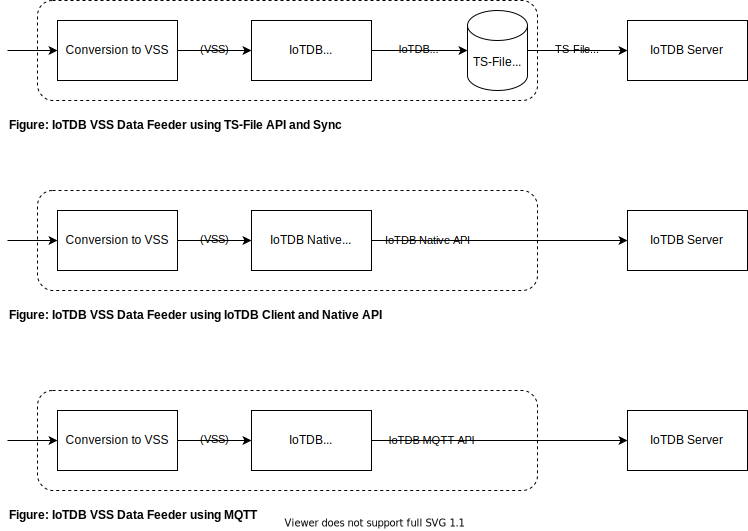
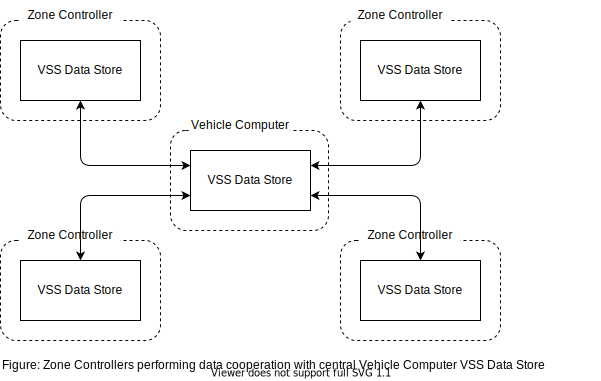

# Implementing VSS Data Store using Apache IoTDB 

# Design Discussion
## Big Picture
### A note on Data Store terminology
The CVII Tech Stack [terminology definitions](https://at.projects.genivi.org/wiki/x/O4BlBQ) defines Data Store as a component with a range of possible classes of providers. From State Storage that may be a very simple 'last value' store of key/values data pairs in an in-memory table, to more functional Databases (DB).

Whilst State Storage as described has its place here we are interested in the added value derived from more functional Data Stores such as DBs deployable in-vehicle. It allows a separation of concerns. VSS Data Feeders can concentrate on efficiently feeding data without being tied to the details of data consumers. In turn a DB can be interfaced to a variety of Data Servers, independent of the feeders, whilst having advantages in data safety and control. DBs also provide the possibility of zonal data processing at the Edge for a variety of reasons, whilst also mitigating gaps in cloud connectivity.

## Apache IoTDB
Whilst there are a variety of OSS Timeseries or No-SQL DBs available many were developed for Cloud deployment or for use cases different to the needs of IoT/Mobility such as logging or document storage. In contrast [Apache IoTDB](https://iotdb.apache.org/) is a Timeseries DB developed from the ground up for high volume IoT data and deployment on the Edge as well as the Cloud. It also has a wide range of Clients covering a variety of languages and good integration into the Apache family of big data solutions such as Spark, Hadoop and Flink, along with other common frameworks such as Grafana. For these reasons IoTDB has been selected for investigation. However it's worth noting that many of the general concepts will apply to other databases.

IoTDB has a client-server architecture. The storage backend uses the so called TS-File data file format. As already stated IoTDB has been designed so that the Engine is deployable on the edge on MPUs/SoCs and a variety of clients are available supporting different languages. These clients communicate with the server via the Native (Session) API. Interestingly there is also a lightweight API for directly working with a TS-File and utilities to sync TS-Files between servers. In addition, IoTDB v0.13.x introduced a MQTT Broker into the server, allowing clients to send data via MQTT. This is particularly helpful in supporting very thin clients running in resource constrained data feeders.

In combination this allows for very flexible deployment in a variety of architecture configurations. ECUs with straight forward read/write/query needs, might work directly with TS-Files using the TS-File API. Possibly performing data processing within the ECU before syncing the data to a central or domain IoTDB Server. ECUs can also use the Client Native Session API to talk directly to a IoTDB Server. If they are resource constrained they might use MQTT to send data. Zone/Domain Controllers can have local DBs with sync between them or to a Central Controller, with the Session API providing rich query and data quality support.

The IoTDB suite also provides support for JDBC but this is not recommended due to its poor write performance compared to the Session and TS-File APIs.

### Deployment illustration: VSS Data Store for Data Server
The figure shows Apache IoTDB acting as the storage backend for a VSS Data Store. VSS Data Feeders write to the DB using one of the three methods described above, synchronising IoTDB TS-Files or via a client. The VSS Data Store can then be connected to a VSS Data Server, which abstracts the details away from the higher level APIs querying VSS data.

### Deployment illustration: Zonal VSS Data Stores
A common automotive architecture pattern is a separation of concerns into functional blocks. Historically in the most simplest sense through ECUs. More recently through consolidating functions into Zone or Domain Controllers. Possibly with a central Vehicle Computer orchestrating the wider vehicle processing. The figure below shows such an architecture.

This supports a separation of concerns with each zone having its own VSS Data Store and sharing data as appropriate. This allows high data volumes to be captured within the zone if required, processed if necessary to determine some high level insight, and some low volume data to be shared with the central Vehicle Computer. An ADAS Controller may be recording data at millisecond intervals for processing but reporting high level events to the central Vehicle Computer.

#### Investigation Points
How much data is shared between zones and how is in part a matter for detailed product architecture but some general design pattern ideas can be investigated.
- [ ] Protocol for sharing between zones. Share using: 1) DB features to directly share between DB Servers (direct storage backend comms). Its expected that DB will have strong features for coordinating large data volumes 2) via VSS Data Servers, e.g. using VISS protocol 'Set' method, Controller A uses VISS Client to update Controller B. Currently VISS/VSS has no efficient binary protocol serialisation, but that is being worked on.
- [ ] Ability for DB APIs to share differing amounts of data. Full vs partial synch/replication/transfer.

## Schema / Query

IoTDB allows you to both set a DB schema and ask the DB to derive for you. In the former case there is scope for vss-tool type tooling to generate a schema from a data model definition.

It is stating the obvious but of course a Timeseries DB allows for rich querying of the data in an efficient manner. IoTDB allows for the possibility for that to occur in-vehicle, without precluding further processing in the cloud.

### Investigation Points
- [ ] Automated VSS to IoTDB schema generation, ideally using the vss-tools design pattern.
- [ ] Interfacing IoTDB queries to VSS Data Servers, e.g. VISS and GraphQL.