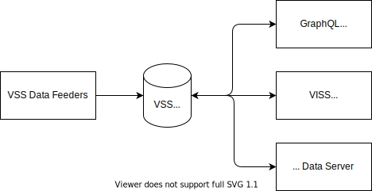

# Implementing VSS Data Store using Apache IoTDB 

# Design Discussion
## Big Picture

### A note on Data Store terminology
The CVII Tech Stack [terminology definitions](https://at.projects.genivi.org/wiki/x/O4BlBQ) defines Data Store as a component with a range of possible class providers. From State Storage that may be a very simple 'last value' store of key/values data pairs in an in-memory table, to more functional Databases (DB).

Whilst State Storage as described has its place here we are interested in the added value derived from more functional Data Stores such as DBs deployable in-vehicle. That can be particularly useful in Mobility devices which can not be certain of constant high speed data connections to the cloud.

## Apache IoTDB
Whilst there are a variety of OSS Timeseries or No-SQL DBs available many were developed for Cloud deployment or for use cases different to the needs of IoT/Mobility such as logging or document storage. In contrast [Apache IoTDB](https://iotdb.apache.org/) is a Timeseries DB developed from the ground up for high volume IoT data and deployment on the Edge as well as the Cloud. It also has a wide range of Clients covering a variety of languages and good integration into the Apache family of big data solutions such as Spark, Hadoop and Flink, along with other common frameworks such as Grafana. For these reasons IoTDB has been selected for investigation. However its worth noting that many of the general concepts will apply to other databases.

IoTDB has a client-server architecture. The storage backend uses the so called TS-File data file format. As already stated IoTDB has been designed so that the Engine is deployable on the edge on MPUs/SoCs and a variety of clients are available supporting different languages. These clients communicate with the server via the Native (Session) API. Interestingly there is also a lightweight API for directly working with a TS-File and utilities to sync TS-Files between servers. The IoTDB suite also provides support for JDBC but this is not recommended due to its poor write performance compared to the Session and TS-File APIs.

In combination this allows for very flexible deployment in a variety of architecture configurations. 'Slim' ECUs representing actuators might work with TS-Files using the TS-File API and or use the Native Session API to call the server. Zone and domain controllers may have their own Data Stores with links betweens. A central server may receive data from controllers or slim ECUs.

## Deployment illustrations
### Central (ECU) data store running IoTDB Engine
In-vehicle IoTDB Server with TS Files. Feed by TS-File Sync and or IoTDB Clients.

### Domain/Zone ECU data store
Possibly multi-server, with optional sync/replication.
+ve: Possibility of local high performance query.
+ve: Possibility of seperation of concerns. Zone process and transmit less to central/cloud.

### Slim function ECU with DB store
feeder=>IoTDB write to TS-File, Sync TS-File
+ve: Transmitting compressed data.

### Slim function ECU with DB client
feeder=>IoTDB Client=>IoTDB Server

## Schema / Query

IoTDB allows you to both set a DB schema and ask the DB to derive for you. In the former case there is scope for vss-tool type tooling to generate a schema from a data model definition.

It is stating the obvious but of course a Timeseries DB allows for rich querying of the data in an efficient manner. IoTDB allows for the possibility for that to occur in-vehicle, without precluding further processing in the cloud.